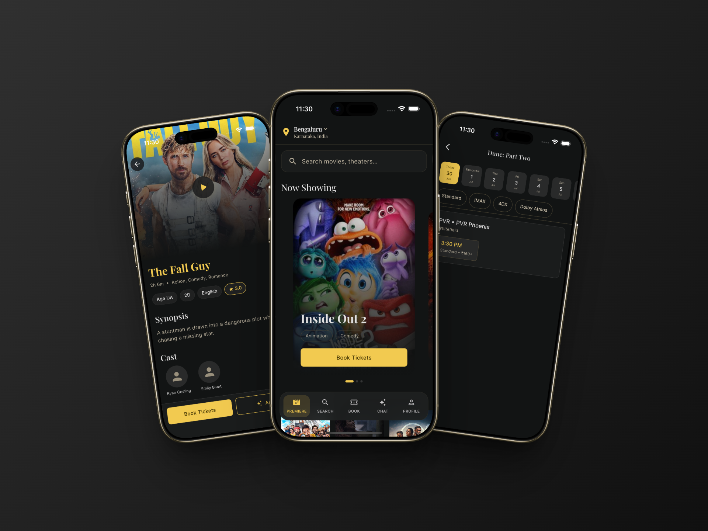

# CineBook



AI-powered movie booking platform — discover films, pick showtimes, book seats in real time, and let a Claude-powered assistant handle the full flow from chat.

**Live demo**

| Service | URL |
|---|---|
| API | [cinebook-api.divyansh.space](https://cinebook-api.divyansh.space/health) |
| Admin dashboard | [cinebookadmin.divyansh.space](https://cinebookadmin.divyansh.space) |

---

## Features

**Customer app (Flutter)**
- Phone-OTP login with persistent JWT sessions
- Movie discovery with filters (date, genre, chain, format, language, age rating)
- 5-step booking: movie → showtime → seat map → payment → confirmation
- Live seat map with tier pricing, 5-minute holds, and WebSocket updates
- AI chat assistant that can search, hold seats, apply promos, and complete bookings

**Admin dashboard (React)**
- Role-based access for Admins and Hall Managers
- Catalog, theatre, and screen management
- Show scheduling with business-rule validation
- Reports, activity logs, and booking overrides

**Backend (Fastify + PostgreSQL)**
- REST API, WebSocket seat feed, and simulated payments
- Custom Claude tool-calling loop — **25 tools, no LangChain / agent framework**
- Booking sub-agent for multi-step chat flows
- Rate limiting, retries, circuit breaker, request tracing, and metrics

---

## Repo layout

```
├── server/          # API — Node + TypeScript + Fastify + Prisma + PostgreSQL
├── admin/           # Admin panel — React + Vite + TypeScript + Tailwind v4
├── cinebook_app/    # Customer app — Flutter
├── assets/          # README and shared media
└── deploy.sh        # One-shot redeploy script for production
```

---

## Tech stack

| Layer | Stack |
|---|---|
| Customer app | Flutter |
| Admin | React 19, Vite, TypeScript, Tailwind v4 |
| Backend | Node, TypeScript, Fastify, Prisma |
| Database | PostgreSQL 16 |
| AI | Anthropic Claude (`claude-sonnet-4-6`) — hand-written tool loop |
| Auth | Phone OTP (simulated) + JWT access/refresh |
| Realtime | WebSocket + Postgres `LISTEN/NOTIFY` |

---

## Getting started

### Prerequisites

- **Docker** — Postgres and the API (Option A below)
- **Node 20+** and **pnpm** — admin dashboard and local API dev
- **Flutter SDK 3.12+** — customer app
- Copy `server/.env.example` → `server/.env` and set `JWT_SECRET`, `ANTHROPIC_API_KEY`, etc.

### 1. Backend

**Docker (recommended)**

```bash
cd server
docker compose up -d --build
docker compose exec server pnpm seed    # first run only
# Health check: http://localhost:4000/health
```

**Local dev (hot reload)**

```bash
cd server
docker compose up -d postgres           # DB only — don't run both API modes on :4000
pnpm install
pnpm prisma migrate dev
pnpm seed
pnpm dev                                # http://localhost:4000
```

> In `NODE_ENV=development`, OTP responses include a `devCode` that the app and admin pre-fill. In production/Docker, read codes from server logs or set `DEMO_OTP` in `.env`.

### 2. Admin dashboard

```bash
cd admin
pnpm install
pnpm dev                                # http://localhost:5173
```

For a production build pointing at the live API:

```bash
VITE_API_URL=https://cinebook-api.divyansh.space pnpm build
```

### 3. Customer app

```bash
cd cinebook_app
flutter pub get
flutter run
```

**API URL** is set at build/run time via `--dart-define`:

| Target | Command |
|---|---|
| Live API | `flutter run --dart-define=API_BASE_URL=https://cinebook-api.divyansh.space` |
| Local (iOS Simulator / macOS) | `flutter run` → `http://localhost:4000` |
| Local (Android emulator) | `flutter run` → `http://10.0.2.2:4000` (automatic) |
| Physical device on LAN | `flutter run --dart-define=API_HOST=192.168.x.x` |

List available devices with `flutter devices`, then pass `-d "Device Name"` or the device UUID.

Release APK against the live API:

```bash
flutter build apk --dart-define=API_BASE_URL=https://cinebook-api.divyansh.space
```

---

## Demo credentials

After seeding, log in with phone OTP using any of these numbers:

| Role | Phone |
|---|---|
| Admin | `+919000000001` |
| Hall Manager | `+919000000002` |
| Customer | `+919000000003` |

**Seeded catalog:** 6 movies · 3 chains · 5 theatres · 8 screens · 480 seats · 42 shows over 7 days.

**Promo codes:** `CINE10` · `FIRST50` · `WEEKEND20`

**Test cards (simulated payment)**

| Card | Result |
|---|---|
| `4242424242424242` | Success |
| `4000000000000002` | Declined (402) |
| `4000000000000341` | Random failure; repeated use trips circuit breaker (503) |

---

## Architecture

```
Flutter app ─┐
Admin (React) ┼─ HTTP/JWT ──▶  Fastify API ──▶ Prisma ──▶ PostgreSQL
AI chatbot ──┘                      │
                                    ├─ WebSocket  /ws/shows/:id
                                    └─ Anthropic Claude (custom tool loop)
```

**Roles:** `CUSTOMER` uses the Flutter app · `HALL_MANAGER` schedules shows on assigned screens · `ADMIN` has full access.

Seat holds use Postgres + a periodic sweeper behind a swappable `HoldStore` interface (Redis documented as a one-file upgrade path in the codebase).

---

## Deployment

Production runs on a single DigitalOcean droplet:

- `cinebook-api.divyansh.space` — Fastify API (Docker, port 4000 behind nginx)
- `cinebookadmin.divyansh.space` — static admin build from `admin/dist`

Redeploy from the server:

```bash
cd /opt/cinebook && ./deploy.sh
```

The script pulls latest code, rebuilds the admin bundle with `VITE_API_URL`, and restarts the API container.

---

## Environment variables

Key settings in `server/.env` (see `server/.env.example`):

| Variable | Purpose |
|---|---|
| `DATABASE_URL` | Postgres connection string |
| `JWT_SECRET` | Access/refresh token signing |
| `ANTHROPIC_API_KEY` | Claude chatbot (without it, `/chat` returns 503; everything else works) |
| `CORS_ORIGIN` | Admin dashboard origin for credentialed requests |
| `DEMO_OTP` | Optional fixed OTP for demos (any phone) |

---

## License

Private assignment submission. All rights reserved.
